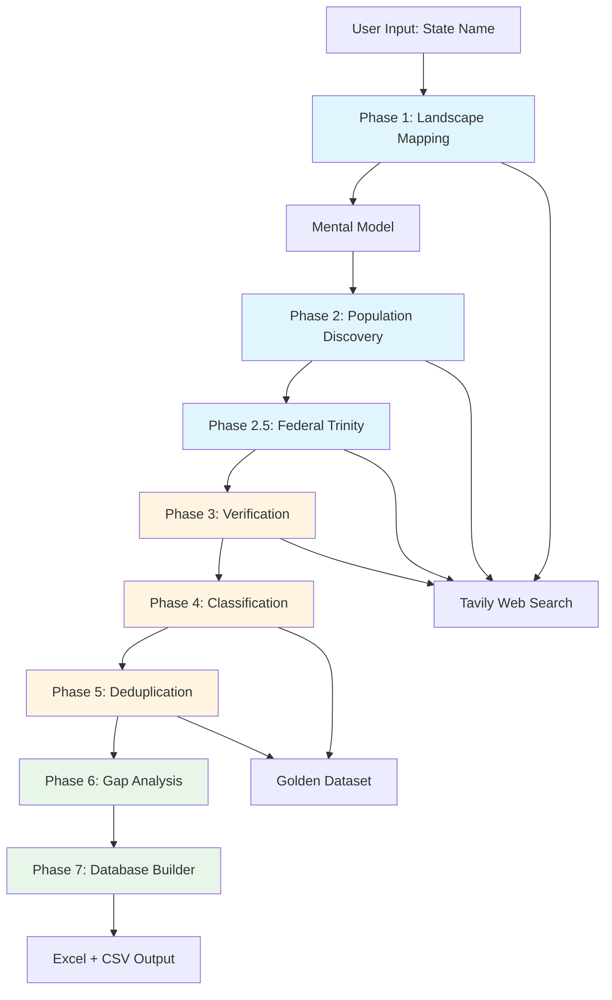
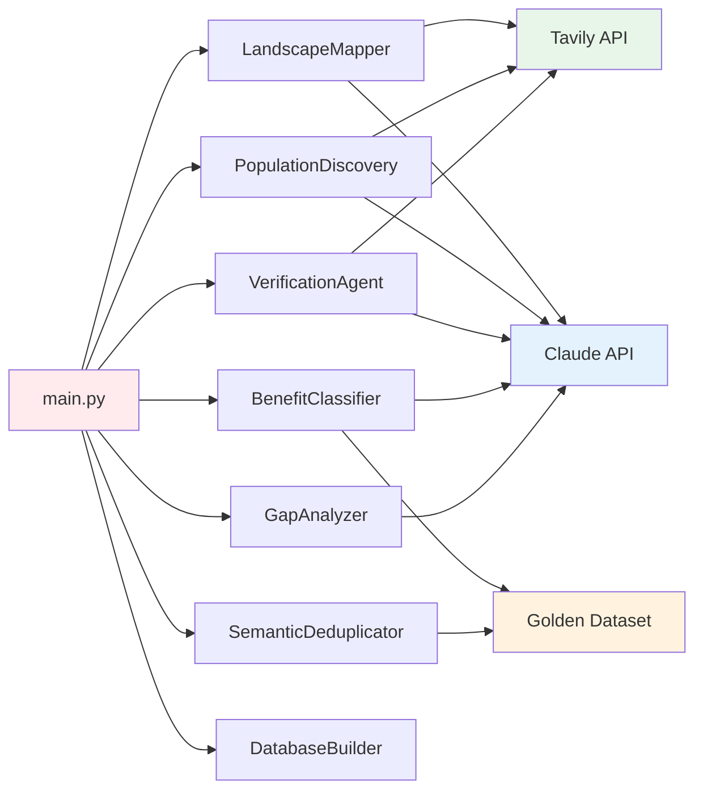
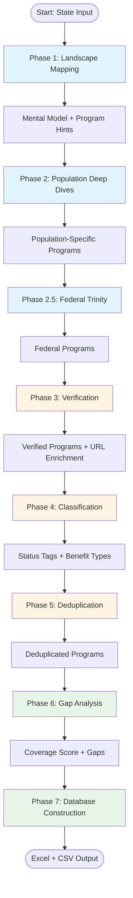
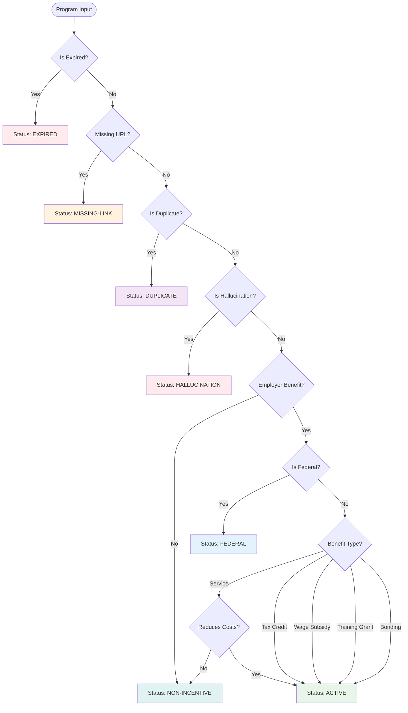

# Incentive Agent Architecture Documentation

## Table of Contents

1. [Introduction](#introduction)
2. [System Overview](#system-overview)
3. [Core Philosophy](#core-philosophy)
4. [7-Phase Pipeline](#7-phase-pipeline)
5. [Agent Catalog](#agent-catalog)
6. [Prompt Library](#prompt-library)
7. [Data Structures](#data-structures)
8. [Decision Trees & Logic](#decision-trees--logic)
9. [External Dependencies](#external-dependencies)
10. [File Structure](#file-structure)
11. [Metrics & Evaluation](#metrics--evaluation)
12. [Configuration](#configuration)

---

## Introduction

The Incentive Agent is a multi-agent AI system designed to discover, verify, classify, and catalog employer hiring incentive programs across all U.S. states. The system uses Claude AI models (Haiku and Sonnet) combined with web search (Tavily API) to build comprehensive databases of programs that provide financial benefits to employers for hiring specific populations.

### Key Capabilities

- **Discovery**: Finds programs through landscape mapping and population-specific searches
- **Verification**: Validates program existence, status, and details
- **Classification**: Categorizes programs by benefit type and status
- **Deduplication**: Identifies and merges duplicate entries
- **Gap Analysis**: Identifies missing programs and coverage gaps
- **Database Construction**: Generates multi-sheet Excel databases and CSV exports

---

## System Overview

### High-Level Architecture



### Component Interaction



---

## Core Philosophy

### "Cast Wide Net, Filter Later"

The discovery phase prioritizes **MAXIMUM RECALL** over precision. The system finds EVERYTHING, including:
- "Duds" (non-incentives, duplicates, expired programs, hallucinations)
- Programs with incomplete information
- Programs with low confidence

**Filtering and classification happen in later phases** (Verification, Classification, Deduplication).

### Why This Approach Works

From the Illinois Golden Dataset analysis:
- **35 total programs found**
- **8 ACTIVE** (23%) - the "good" ones
- **11 DUPLICATES** (31%) - found but need merging
- **9 NON-INCENTIVES** (26%) - found but need filtering
- **4 EXPIRED** (11%) - found but need tagging
- **1 HALLUCINATION** (3%) - found but need removal

**Key insight:** Finding ALL programs during discovery, then classifying them later, is the correct approach.

---

## 7-Phase Pipeline

### Complete Workflow



### Phase Descriptions

#### Phase 1: Landscape Mapping
**Agent:** `LandscapeMapper`  
**Model:** `claude-sonnet-4-20250514` (Temperature: 0.7)  
**Purpose:** Build mental model of state's incentive program architecture

**Input:**
- State name
- Web context from Tavily (optional)

**Output:**
- `MentalModel` object with:
  - `has_state_credits`: Confidence level
  - `has_city_programs`: Confidence level
  - `federal_heavy`: Confidence level
  - `program_architecture`: Type (federal-only, state-centralized, distributed, etc.)
  - `key_agencies`: List of agencies
  - `key_programs_found`: List of program hints
- `LandscapeResult` with recommended searches

**Key Logic:**
- Performs 4 web searches for overview
- Analyzes architecture (federal-heavy vs state-heavy)
- Identifies key agencies
- Provides program hints (not fully verified)

#### Phase 2: Population Deep Dives
**Agent:** `PopulationDiscoveryAgent`  
**Model:** `claude-sonnet-4-20250514` (Temperature: 0.7)  
**Purpose:** Find programs targeting specific populations

**Input:**
- State name
- Population configuration (veterans, disabilities, ex-offenders, etc.)
- Existing programs (for duplicate detection)

**Output:**
- List of `PopulationProgram` objects
- Duplicate candidates

**Populations Searched:**
1. Veterans
2. Disabilities
3. Ex-offenders
4. TANF/SNAP recipients
5. Youth
6. Long-term unemployed

**Key Logic:**
- Performs web search for each population
- Determines if program provides employer benefit
- Filters out job seeker-only services
- Detects duplicates during discovery

#### Phase 2.5: Federal Program Trinity
**Agent:** `PopulationDiscoveryAgent.search_federal_programs()`  
**Model:** `claude-sonnet-4-20250514` (Temperature: 0.7)  
**Purpose:** Explicitly search for universal federal programs

**Programs Searched:**
1. Work Opportunity Tax Credit (WOTC) - *Note: Expired 12/31/2025*
2. Federal Bonding Program
3. WIOA On-the-Job Training (OJT)
4. VA Vocational Rehabilitation & Employment (VR&E)
5. VA Non-Paid Work Experience (NPWE)
6. VA Special Employer Incentives (SEI)
7. DoD SkillBridge

**Key Logic:**
- These programs exist in EVERY state
- Explicit search ensures they're not missed
- Handles WOTC expiration status

#### Phase 3: Verification
**Agent:** `VerificationAgent`  
**Model:** `claude-3-haiku-20240307` (Temperature: 0.3)  
**Purpose:** Quality control - find errors, duplicates, hallucinations

**Input:**
- List of discovered programs
- Golden dataset (for URL enrichment)

**Output:**
- Verified programs with:
  - URL enrichment (from Golden dataset or Tavily)
  - Duplicate groups identified
  - Hallucination candidates flagged
  - Status corrections
  - Value assessments
  - Categorization issues

**7 Verification Checks:**
1. **Duplicate Detection**: Population-specific, geographic subsets, federal repeats
2. **Hallucination Detection**: Programs that don't exist
3. **Status Verification**: Check against known facts (e.g., WOTC expiration)
4. **Value Assessment**: Correct insurance limits vs cash, opportunity costs
5. **Categorization Issues**: Filter non-incentives (procurement, accessibility credits)
6. **Missing Information**: Critical data gaps
7. **URL Validation**: Verify .gov domains, check for broken links

#### Phase 4: Classification
**Agent:** `BenefitClassifier`  
**Model:** `claude-sonnet-4-20250514` (Temperature: 0.3)  
**Purpose:** Assign status tags and benefit types

**Status Tags:**
- `ACTIVE`: Direct employer benefit, verified active
- `FEDERAL`: Federal program with state implementation
- `DUPLICATE`: Duplicate of another program
- `EXPIRED`: Program no longer active
- `NON-INCENTIVE`: No direct employer benefit
- `MISSING-LINK`: Cannot verify, missing URL
- `HALLUCINATION`: Likely fabricated

**Benefit Types:**
- `tax_credit`: Tax credits employers can claim
- `wage_subsidy`: Direct wage subsidies
- `wage_reimbursement`: Wage reimbursement during training
- `training_grant`: Training grants
- `bonding`: Fidelity bonds/insurance
- `risk_mitigation`: Risk reduction programs
- `service`: Free services to employers
- `job_seeker_only`: No employer benefit
- `unknown`: Cannot determine

**Decision Tree:** See [Decision Trees & Logic](#decision-trees--logic)

#### Phase 5: Deduplication
**Agent:** `SemanticDeduplicator`  
**Purpose:** Fuzzy matching against Golden Dataset

**Input:**
- Classified programs
- Golden Dataset (master database)

**Output:**
- New programs (not in Golden Dataset)
- Duplicate matches with similarity scores

**Key Logic:**
- Normalizes program names (expands acronyms, removes punctuation)
- Calculates similarity using `SequenceMatcher` and word overlap
- Threshold: 75% similarity = duplicate
- Handles variations like "OJT" vs "On-the-Job Training"

#### Phase 6: Gap Analysis
**Agent:** `GapAnalyzer`  
**Model:** `claude-sonnet-4-20250514`  
**Purpose:** Identify coverage gaps and calculate coverage score

**Input:**
- Deduplicated programs
- Mental model

**Output:**
- `GapAnalysisResult` with:
  - Coverage score (0-100)
  - Population coverage (6 populations)
  - Program type coverage (6 types)
  - Federal program coverage (4 programs)
  - Gaps list
  - Recommendations

**Coverage Score Calculation:**
```
Coverage Score = 
  Population Coverage (30%) +      # 6 populations
  Program Type Coverage (30%) +    # 6 types
  Federal Coverage (25%) +         # 4 federal programs
  Gap Penalty (15%)                # Subtract for critical gaps
```

**Gap Types:**
- Population gaps: Missing programs for specific populations
- Program type gaps: Missing program types (e.g., training_grant)
- Federal gaps: Missing federal programs
- Verification issues: Missing URLs, low confidence

#### Phase 7: Database Construction
**Agent:** `DatabaseBuilder`  
**Purpose:** Generate multi-sheet Excel database and CSV export

**Output Files:**
1. **Excel Database** (`{state}_incentive_database.xlsx`):
   - Sheet 1: Master Database (all programs)
   - Sheet 2: Active Programs (ACTIVE, FEDERAL only)
   - Sheet 3: Cleanup Required (DUPLICATE, NON-INCENTIVE, EXPIRED, etc.)
   - Sheet 4: Executive Summary (statistics, gaps, recommendations)

2. **CSV Export** (`programs.csv`):
   - Single CSV with all programs

**Columns:**
- Program ID, Program Name, Agency, Status Tag, Benefit Type
- Jurisdiction, Max Value, Target Populations, Description
- Source URL, Confidence, Notes

---

## Agent Catalog

### Primary Agents (7-Phase Pipeline)

#### 1. LandscapeMapper
**File:** `agents/landscape_mapper.py`  
**Phase:** 1  
**Model:** `claude-sonnet-4-20250514`  
**Temperature:** 0.7

**Purpose:**
Maps the incentive program landscape for a state and builds a mental model to guide subsequent discovery.

**Key Methods:**
- `map_landscape(state, include_web_search=True) -> LandscapeResult`
- `_gather_web_context(state) -> str`
- `_analyze_landscape(state, web_context) -> Dict`
- `_determine_architecture(analysis) -> str`

**Output Data Structures:**
- `MentalModel`: Tracks state architecture understanding
- `LandscapeResult`: Contains mental model, agencies, program hints, recommended searches

**Dependencies:**
- Tavily API (web search)
- Anthropic API (Claude)

#### 2. PopulationDiscoveryAgent
**File:** `agents/population_discovery.py`  
**Phase:** 2, 2.5  
**Model:** `claude-sonnet-4-20250514`  
**Temperature:** 0.7

**Purpose:**
Finds programs targeting specific populations and explicitly searches for federal programs.

**Key Methods:**
- `search_population_programs(state, population, existing_programs) -> PopulationSearchResult`
- `search_federal_programs(state, existing_programs) -> List[Dict]`
- `_determine_employer_benefit(program) -> bool`
- `_is_duplicate(program_name, program_data) -> tuple`

**Output Data Structures:**
- `PopulationProgram`: Program representation with population tag
- `PopulationSearchResult`: Programs found + duplicate candidates

**Dependencies:**
- Tavily API (web search)
- Anthropic API (Claude)
- `rapidfuzz` (duplicate detection)

#### 3. VerificationAgent
**File:** `agents/verification.py`  
**Phase:** 3  
**Model:** `claude-3-haiku-20240307`  
**Temperature:** 0.3

**Purpose:**
Quality control - verifies programs, finds duplicates, detects hallucinations, enriches URLs.

**Key Methods:**
- `verify_programs(programs_data) -> dict`
- `_enrich_with_tavily(programs_data, golden_path) -> dict`

**7 Verification Checks:**
1. Duplicate Detection
2. Hallucination Detection
3. Status Verification
4. Value Assessment
5. Categorization Issues
6. Missing Information
7. URL Validation

**Dependencies:**
- Tavily API (URL enrichment)
- Golden Dataset (URL matching)
- Anthropic API (Claude)

#### 4. BenefitClassifier
**File:** `agents/benefit_classifier.py`  
**Phase:** 4  
**Model:** `claude-sonnet-4-20250514`  
**Temperature:** 0.3

**Purpose:**
Classifies programs by benefit type and assigns status tags.

**Key Methods:**
- `classify_programs(programs) -> List[ClassificationResult]`
- `classify_program(program) -> ClassificationResult`
- `_is_expired(program) -> bool`
- `_is_duplicate(program) -> Tuple[bool, Optional[str]]`
- `_determine_benefit_type(program) -> BenefitType`
- `_determine_jurisdiction(program) -> str`
- `_service_reduces_employer_costs(program) -> bool`

**Output Data Structures:**
- `ClassificationResult`: Contains status tag, benefit type, reasoning
- `StatusTag`: Enum (ACTIVE, FEDERAL, DUPLICATE, EXPIRED, NON-INCENTIVE, MISSING-LINK, HALLUCINATION)
- `BenefitType`: Enum (TAX_CREDIT, WAGE_SUBSIDY, etc.)

**Dependencies:**
- Anthropic API (Claude)
- `rapidfuzz` (duplicate detection)
- Known programs list (for duplicate checking)

#### 5. SemanticDeduplicator
**File:** `utils/semantic_deduplicator.py`  
**Phase:** 5  
**Model:** None (rule-based)

**Purpose:**
Fuzzy matching against Golden Dataset to identify duplicates.

**Key Methods:**
- `deduplicate_programs(programs) -> dict`
- `find_duplicate(program) -> Optional[Tuple[Dict, float]]`
- `normalize_name(name) -> str`
- `similarity_score(name1, name2) -> float`

**Logic:**
- Normalizes names (expands acronyms: WOTC → Work Opportunity Tax Credit)
- Uses `SequenceMatcher` for fuzzy matching
- Calculates word overlap
- Threshold: 75% similarity = duplicate

**Dependencies:**
- Golden Dataset (Excel file)
- `difflib.SequenceMatcher`

#### 6. GapAnalyzer
**File:** `agents/gap_analyzer.py`  
**Phase:** 6  
**Model:** `claude-sonnet-4-20250514`

**Purpose:**
Identifies gaps in coverage and calculates coverage score.

**Key Methods:**
- `identify_gaps(programs, state, mental_model) -> GapAnalysisResult`
- `_check_population_coverage(programs) -> Dict[str, bool]`
- `_check_program_type_coverage(programs) -> Dict[str, bool]`
- `_check_federal_coverage(programs) -> Dict[str, bool]`
- `_calculate_coverage_score(...) -> float`
- `_find_hallucination_candidates(programs) -> List[Dict]`

**Output Data Structures:**
- `GapAnalysisResult`: Contains coverage score, gaps, recommendations
- `CoverageGap`: Individual gap with type, description, severity

**Dependencies:**
- Anthropic API (Claude)

#### 7. DatabaseBuilder
**File:** `utils/database_builder.py`  
**Phase:** 7  
**Model:** None (data processing)

**Purpose:**
Builds multi-sheet Excel database and CSV export.

**Key Methods:**
- `build_database(programs, gaps, mental_model, output_path) -> str`
- `_assign_program_ids()`
- `_create_master_sheet(wb)`
- `_create_active_sheet(wb)`
- `_create_cleanup_sheet(wb)`
- `_create_summary_sheet(wb)`

**Output:**
- Excel file with 4 sheets
- CSV file with all programs

**Dependencies:**
- `pandas`
- `openpyxl`

### Supporting Agents (Legacy/Alternative)

#### DiscoveryAgent
**File:** `agents/discovery.py`  
**Purpose:** Original discovery agent (narrative format)  
**Model:** `claude-sonnet-4-20250514`  
**Status:** Legacy - used in traditional pipeline

#### ExtractionAgent
**File:** `agents/extraction.py`  
**Purpose:** Converts narrative research to structured JSON  
**Model:** `claude-sonnet-4-20250514`  
**Status:** Used in traditional pipeline

#### LeanDiscoveryAgent
**File:** `agents/lean_discovery.py`  
**Purpose:** Cost-efficient discovery (Haiku for URLs, Sonnet for verification)  
**Model:** `claude-3-haiku-20240307`  
**Status:** Alternative workflow

#### EnhancedDiscoveryAgent
**File:** `agents/enhanced_discovery.py`  
**Purpose:** Enhanced discovery with known programs list  
**Model:** `claude-sonnet-4-20250514`  
**Status:** Alternative workflow

#### DeepVerificationAgent
**File:** `agents/deep_verification.py`  
**Purpose:** Deep verification with Sonnet  
**Model:** `claude-3-5-sonnet-20241022`  
**Status:** Used in lean pipeline

#### DiscoveryController
**File:** `agents/discovery_controller.py`  
**Purpose:** Orchestrates discovery with stop conditions  
**Model:** None (rule-based)

**Key Features:**
- Stop condition logic
- Duplicate detection
- Expired program handling
- Search session tracking

---

## Prompt Library

### LandscapeMapper Prompt

**Location:** `agents/landscape_mapper.py:170-228`

```python
prompt = f"""<role>
You are an expert analyst mapping the employer hiring incentive landscape for {state}.

Your goal is to understand the STRUCTURE and ARCHITECTURE of programs in this state,
not to list every program in detail (that comes later).
</role>

<web_context>
{web_context if web_context else "No web context available - use your knowledge."}
</web_context>

<task>
Analyze {state}'s hiring incentive ecosystem and answer:

1. ARCHITECTURE CLASSIFICATION
   - Is this a "federal-heavy" state (few state-specific programs)?
   - Does the state have its OWN tax credits for hiring?
   - Are there city/county-level programs?
   - Is the program landscape centralized (one agency) or distributed?

2. KEY AGENCIES
   - Which state agencies administer hiring incentives?
   - Department of Labor/Employment?
   - Department of Revenue (for tax credits)?
   - Economic Development agency?
   - Workforce Development Board?

3. PROGRAM PATTERNS
   - What populations are targeted? (veterans, disabilities, ex-offenders, etc.)
   - What program types exist? (tax credits, wage subsidies, OJT, bonding, etc.)
   - Are there unique state-specific programs?

4. RECOMMENDED SEARCH STRATEGIES
   - What specific searches should we do next?
   - Which agencies should we investigate?
   - What populations need deeper investigation?
</task>

<output_format>
Respond in this exact JSON format:
{{
    "state_tax_credits": true/false,
    "no_state_credits_found": true/false,
    "city_programs": true/false,
    "no_city_programs_found": true/false,
    "mostly_federal": true/false,
    "architecture_notes": "Brief description of program architecture",
    "key_agencies": ["Agency 1", "Agency 2"],
    "programs": [
        {{"name": "Program Name", "type": "tax_credit/wage_subsidy/etc", "confidence": "high/medium/low"}}
    ],
    "populations_to_search": ["veterans", "disabilities", "ex_offenders"],
    "recommended_searches": [
        "{state} specific search query 1",
        "{state} specific search query 2"
    ]
}}
</output_format>
"""
```

### PopulationDiscoveryAgent Prompt

**Location:** `agents/population_discovery.py:295-351`

```python
prompt = f"""<role>
You are an expert researcher finding EMPLOYER hiring incentive programs in {state}
that target {population['name']}.

CRITICAL: Only include programs that provide DIRECT BENEFIT TO EMPLOYERS.
- Tax credits employers can claim
- Wage subsidies/reimbursements to employers
- Training grants for employers
- Bonding/insurance that protects employers
- Risk mitigation programs for employers

DO NOT include:
- Job seeker services (resume help, job search assistance)
- Programs that only benefit the employee
- General workforce development without employer component
</role>

<web_context>
{web_context if web_context else "No web context available."}
</web_context>

<population>
Target Population: {population['name']}
Related Search Terms: {', '.join(population.get('search_terms', []))}
Common Programs for This Population: {', '.join(population.get('common_programs', []))}
</population>

<task>
Find ALL employer incentive programs in {state} targeting {population['name']}.

For each program, determine:
1. Is this a REAL employer benefit? (tax credit, wage subsidy, training grant, bonding)
2. What is the jurisdiction? (federal, state, local)
3. What is the maximum value to employers?
4. What agency administers it?
5. What is the official source URL?
</task>

<output_format>
Respond with a JSON array of programs:
[
    {{
        "program_name": "Official Program Name",
        "agency": "Administering Agency",
        "program_type": "tax_credit|wage_subsidy|training_grant|bonding|other",
        "jurisdiction": "federal|state|local",
        "max_value": "$X,XXX per employee" or "Varies",
        "description": "Brief description of employer benefit",
        "source_url": "https://...",
        "confidence": "high|medium|low",
        "employer_benefit_type": "direct_tax_credit|wage_reimbursement|training_subsidy|risk_mitigation|none"
    }}
]

If no programs found, return an empty array: []
</output_format>
"""
```

### Federal Program Trinity Prompt

**Location:** `agents/population_discovery.py:516-578`

```python
prompt = f"""<role>
You are an expert researcher finding FEDERAL employer hiring incentive programs available in {state}.

These programs exist in EVERY state, so you should find them:
1. Work Opportunity Tax Credit (WOTC) - Federal tax credit
2. Federal Bonding Program - Free fidelity bonds
3. WIOA On-the-Job Training (OJT) - Wage reimbursement
4. VA Vocational Rehabilitation & Employment (VR&E) - Multiple components
5. VA Non-Paid Work Experience (NPWE)
6. VA Special Employer Incentives (SEI)
7. DoD SkillBridge - Military training program
</role>

<web_context>
{web_context if web_context else "No web context - use your knowledge of federal programs."}
</web_context>

<task>
Find ALL federal hiring incentive programs available to employers in {state}.

CRITICAL: WOTC expired December 31, 2025. Mark it as EXPIRED but note it's pending reauthorization.

For each program found, provide:
- Program Name (official title)
- Administering Agency (federal + state agency if applicable)
- Program Type (tax_credit, wage_subsidy, bonding, training, etc.)
- Status (active, expired, pending)
- Maximum Value Per Employee
- Target Populations
- Brief Description
- Source URL (.gov preferred)
- Confidence Level

Include programs even if:
- Status is unclear
- Information is incomplete
- You're not 100% certain

Better to include all federal programs and verify later than miss any.
</task>

<output_format>
Return a JSON array of programs:
[
  {{
    "program_name": "Work Opportunity Tax Credit (WOTC)",
    "agency": "U.S. Department of Labor, {state} Department of Employment Security",
    "program_type": "tax_credit",
    "jurisdiction": "federal",
    "status": "expired",
    "status_details": "Expired December 31, 2025 - Pending Congressional reauthorization",
    "max_value": "$9,600 per employee (varies by target group)",
    "target_populations": ["veterans", "ex-offenders", "SNAP recipients", "long-term unemployed", "youth"],
    "description": "Federal income tax credit for hiring individuals from designated target groups",
    "source_url": "https://www.dol.gov/agencies/eta/wotc",
    "confidence": "high"
  }},
  ...
]
</output_format>

Current date: January 29, 2026
"""
```

### VerificationAgent Prompt

**Location:** `agents/verification.py:78-541`

The verification prompt is extensive (7 checks). See the file for the complete prompt. Key sections:

1. **Duplicate Detection**: Identifies population-specific, geographic, and federal duplicates
2. **Hallucination Detection**: Finds programs that don't exist
3. **Status Verification**: Checks against known facts (WOTC expiration)
4. **Value Assessment**: Corrects insurance limits vs cash, opportunity costs
5. **Categorization Issues**: Filters non-incentives
6. **Missing Information**: Identifies critical data gaps
7. **URL Validation**: Verifies .gov domains

**Key Instruction:**
```
You are a ruthless quality control inspector verifying incentive program data.

Your performance is measured by HOW MANY ERRORS YOU FIND.

Someone gave you this data claiming it's accurate. Your job: PROVE THEM WRONG.

Be skeptical. Be critical. Find every mistake.
```

### BenefitClassifier Decision Logic

The classifier uses a decision tree (see [Decision Trees & Logic](#decision-trees--logic)) rather than a single prompt. It calls Claude for complex cases but primarily uses rule-based logic.

---

## Data Structures

### MentalModel

**Location:** `agents/landscape_mapper.py:25-51`

```python
@dataclass
class MentalModel:
    state: str
    has_state_credits: ConfidenceLevel = ConfidenceLevel.UNKNOWN
    has_city_programs: ConfidenceLevel = ConfidenceLevel.UNKNOWN
    federal_heavy: ConfidenceLevel = ConfidenceLevel.UNKNOWN
    program_architecture: str = "unknown"  # e.g., "centralized", "distributed", "federal-only"
    key_agencies: List[str] = field(default_factory=list)
    key_programs_found: List[str] = field(default_factory=list)
    search_patterns: Dict[str, bool] = field(default_factory=dict)
```

**ConfidenceLevel Enum:**
- `UNKNOWN`
- `LOW`
- `MEDIUM`
- `HIGH`

### PopulationProgram

**Location:** `agents/population_discovery.py:15-85`

```python
@dataclass
class PopulationProgram:
    program_name: str
    population: str  # "veterans", "disabilities", etc.
    agency: str
    program_type: str
    jurisdiction: str  # "federal", "state", "local"
    max_value: str
    description: str
    source_url: str
    confidence: str  # "high", "medium", "low"
    is_employer_benefit: bool
    raw_data: Dict[str, Any]
```

### ClassificationResult

**Location:** `agents/benefit_classifier.py:47-70`

```python
@dataclass
class ClassificationResult:
    program_name: str
    status_tag: StatusTag
    benefit_type: BenefitType
    is_employer_benefit: bool
    reduces_employer_costs: bool
    jurisdiction: str
    confidence: str
    reasoning: str
    original_data: Dict[str, Any]
```

### GapAnalysisResult

**Location:** `agents/gap_analyzer.py:59-96`

```python
@dataclass
class GapAnalysisResult:
    state: str
    total_programs: int
    active_programs: int
    coverage_score: float  # 0-100
    population_coverage: Dict[str, bool]
    program_type_coverage: Dict[str, bool]
    federal_program_coverage: Dict[str, bool]
    gaps: List[CoverageGap]
    verification_issues: List[Dict[str, Any]]
    hallucination_candidates: List[Dict[str, Any]]
    recommendations: List[str]
```

### LandscapeResult

**Location:** `agents/landscape_mapper.py:74-82`

```python
@dataclass
class LandscapeResult:
    mental_model: MentalModel
    agencies_discovered: List[Dict[str, Any]]
    program_hints: List[Dict[str, Any]]  # Programs found but not fully verified
    recommended_searches: List[str]
    architecture_notes: str
    raw_response: str
```

---

## Decision Trees & Logic

### Benefit Classification Decision Tree



### Duplicate Detection Logic

**Location:** `agents/discovery_controller.py:241-296`

**Decision Criteria:**
1. **Exact URL Match** + Name similarity ≥50% → Duplicate
2. **Name similarity ≥90%** → Duplicate
3. **Name similarity ≥70%** + Agency similarity ≥70% → Duplicate
4. **Name similarity ≥60%** + Agency similarity ≥60% + Value match → Duplicate

**Normalization:**
- Lowercase, remove extra whitespace
- Remove common words: "the", "a", "an", "of", "for", "and", "or", "program", "initiative"
- URL normalization: Remove protocol, trailing slash, www

### Employer Benefit Determination

**Location:** `agents/population_discovery.py:400-460`

**Logic:**
1. Check `employer_benefit_type` field
2. Check program type (tax_credit, wage_subsidy, etc.)
3. Check for max_value with "$"
4. Exclude: "none", "job_seeker_only", "support_service"

### Coverage Score Calculation

**Location:** `agents/gap_analyzer.py:396-415`

```python
def _calculate_coverage_score(self, population_coverage, program_type_coverage, 
                               federal_coverage, gaps) -> float:
    # Population coverage: 30%
    pop_score = sum(1 for v in population_coverage.values() if v) / len(population_coverage) * 30
    
    # Program type coverage: 30%
    type_score = sum(1 for v in program_type_coverage.values() if v) / len(program_type_coverage) * 30
    
    # Federal coverage: 25%
    fed_score = sum(1 for v in federal_coverage.values() if v) / len(federal_coverage) * 25
    
    # Gap penalty: up to 15%
    critical_gaps = sum(1 for g in gaps if g.severity == "critical")
    gap_penalty = min(critical_gaps * 3, 15)
    
    score = pop_score + type_score + fed_score + (15 - gap_penalty)
    return round(min(100, max(0, score)), 1)
```

**Formula:**
```
Coverage Score = 
  (Populations Covered / 6) × 30 +
  (Program Types Found / 6) × 30 +
  (Federal Programs Found / 4) × 25 +
  (15 - Critical Gaps × 3)
```

### Stop Conditions

**Location:** `agents/discovery_controller.py:123-201`

**Conditions:**
1. **Hard Limit**: 15 searches
2. **Pattern Emerged**: No state programs after 3 searches
3. **All Populations Covered**: All 6 populations searched
4. **Diminishing Returns**: < 1 program per search after 10 searches
5. **Coverage Complete**: Coverage score > 90%
6. **Consecutive Empty**: 3 consecutive searches with no results

---

## External Dependencies

### Tavily API

**Purpose:** Web search for program discovery and URL enrichment  
**Usage:**
- Landscape mapping: 4 queries for overview
- Population discovery: 1-2 queries per population
- Federal programs: 7 queries for federal trinity
- URL enrichment: 1 query per program missing URL

**Configuration:**
- API key in `.env`: `TAVILY_API_KEY`
- Default depth: `basic`
- Max results: 2-3 per query

### Anthropic API (Claude)

**Models Used:**
- `claude-sonnet-4-20250514`: Primary model for discovery and classification (Temperature: 0.7 for discovery, 0.3 for classification)
- `claude-3-haiku-20240307`: Cost-efficient model for verification (Temperature: 0.3)
- `claude-3-5-sonnet-20241022`: Deep verification in lean pipeline

**Configuration:**
- API key in `.env`: `ANTHROPIC_API_KEY`
- Temperature settings vary by agent (see Agent Catalog)

### Golden Dataset

**Purpose:** Reference dataset for deduplication and URL matching  
**Location:** `agents/Golden_Dataset.xlsx`  
**Format:** Excel file with multiple sheets:
- Master Database: All programs
- Active Programs: Filtered active programs

**Usage:**
- Semantic deduplication: Fuzzy matching against master database
- URL enrichment: Match program names to get official URLs

### Python Libraries

**Core:**
- `anthropic`: Claude API client
- `pandas`: Data processing
- `openpyxl`: Excel file generation
- `rapidfuzz`: Fuzzy string matching
- `difflib`: Sequence matching

**Utilities:**
- `python-dotenv`: Environment variable management
- `requests`: HTTP requests (if needed)

---

## File Structure

```
incentive_agent/
├── main.py                          # Entry point, pipeline orchestration
├── ARCHITECTURE.md                  # This file
├── CLAUDE.md                        # Project context and tips
├── README.md                        # Project overview
├── requirements.txt                 # Python dependencies
│
├── agents/                          # AI agents
│   ├── landscape_mapper.py          # Phase 1: Landscape mapping
│   ├── population_discovery.py      # Phase 2: Population searches
│   ├── verification.py              # Phase 3: Verification
│   ├── benefit_classifier.py        # Phase 4: Classification
│   ├── gap_analyzer.py              # Phase 6: Gap analysis
│   ├── discovery_controller.py      # Stop conditions, duplicate detection
│   ├── discovery.py                 # Legacy discovery agent
│   ├── extraction.py                # Narrative to JSON extraction
│   ├── lean_discovery.py            # Cost-efficient discovery
│   ├── enhanced_discovery.py        # Enhanced discovery
│   ├── deep_verification.py         # Deep verification
│   └── Golden_Dataset.xlsx          # Reference dataset
│
├── utils/                           # Utilities
│   ├── semantic_deduplicator.py     # Phase 5: Fuzzy deduplication
│   ├── database_builder.py          # Phase 7: Excel/CSV generation
│   ├── file_handler.py              # File I/O utilities
│   ├── tavily_client.py             # Tavily API wrapper
│   ├── golden_dataset.py            # Golden dataset loader
│   └── ...
│
└── outputs/                         # Output files
    ├── latest/                      # Most recent results
    └── aligned_YYYYMMDD_HHMMSS/     # Timestamped results
        ├── 01_landscape.json
        ├── 02_population_discovery.json
        ├── 03_verification_results.json
        ├── 04_classification.json
        ├── 05_deduplication.json
        ├── 06_gap_analysis.json
        ├── 07_executive_summary.txt
        ├── {state}_incentive_database.xlsx
        └── programs.csv
```

### Output File Naming

**Timestamped Folders:**
- Format: `aligned_YYYYMMDD_HHMMSS`
- Example: `aligned_20260129_132112`

**Phase Output Files:**
- `01_landscape.json`: Landscape mapping results
- `02_population_discovery.json`: Population search results
- `03_verification_results.json`: Verification results
- `04_classification.json`: Classification results
- `05_deduplication.json`: Deduplication results
- `06_gap_analysis.json`: Gap analysis results
- `07_executive_summary.txt`: Text summary

**Final Outputs:**
- `{state}_incentive_database.xlsx`: Multi-sheet Excel database
- `programs.csv`: CSV export

---

## Metrics & Evaluation

### Coverage Completeness vs Discovery Rate

**Coverage Completeness (0-100%):**
Measures how well the programs you found cover expected categories. Does NOT compare to golden dataset.

**Formula:**
```
Coverage Score = 
  Population Coverage (30%) +      # 6 populations
  Program Type Coverage (30%) +    # 6 types
  Federal Coverage (25%) +         # 4 federal programs
  Gap Penalty (15%)                # Subtract for critical gaps
```

**Discovery Rate:**
Measures how many programs you found vs. how many exist in the golden dataset.

**Formula:**
```
Discovery Rate = (Programs Found / Programs in Golden Dataset) × 100%
```

**Example (Illinois):**
- **Coverage Completeness**: 95% (high quality of what was found)
- **Discovery Rate**: 48.6% (17 found / 35 total)
- **Interpretation**: Found programs are high quality, but missing ~18 programs

### Status Tag Distribution

**Target Distribution (from Illinois Golden Dataset):**
- ACTIVE: ~23%
- FEDERAL: ~20%
- DUPLICATE: ~31%
- NON-INCENTIVE: ~26%
- EXPIRED: ~11%
- HALLUCINATION: ~3%

**Note:** High percentage of duplicates and non-incentives is EXPECTED and GOOD - it means the system is finding everything, then filtering later.

### Performance Metrics

**Discovery Phase:**
- Programs found per search: Target > 1.0
- Search efficiency: Programs found / API calls
- Coverage by population: 6/6 = 100%

**Verification Phase:**
- URL enrichment rate: % of programs with URLs after enrichment
- Error detection rate: Issues found / programs verified

**Classification Phase:**
- Classification confidence: % high confidence
- Status tag accuracy: Verified against golden dataset

---

## Configuration

### Environment Variables

**Required:**
- `ANTHROPIC_API_KEY`: Claude API key
- `TAVILY_API_KEY`: Tavily API key (optional but recommended)

**Optional:**
- `GOLDEN_DATASET_PATH`: Path to Golden Dataset (default: `agents/Golden_Dataset.xlsx`)
- `OUTPUT_DIR`: Output directory (default: `outputs`)

### Model Configuration

**Discovery Agents:**
- Model: `claude-sonnet-4-20250514`
- Temperature: 0.7 (more creative for discovery)

**Verification Agent:**
- Model: `claude-3-haiku-20240307`
- Temperature: 0.3 (more focused for verification)

**Classification Agent:**
- Model: `claude-sonnet-4-20250514`
- Temperature: 0.3 (more consistent for classification)

### Stop Conditions

**Configuration (in `DiscoveryController`):**
- `MAX_SEARCHES = 15`: Hard limit on searches
- `PATTERN_SEARCH_THRESHOLD = 3`: Searches before declaring pattern
- `DIMINISHING_RETURNS_THRESHOLD = 10`: Searches before checking diminishing returns
- `COVERAGE_THRESHOLD = 90.0`: Coverage score to stop

### Population Configuration

**Standard Populations (in `main.py`):**
```python
STANDARD_POPULATIONS = [
    {"id": "veterans", "name": "Veterans", ...},
    {"id": "disabilities", "name": "Individuals with Disabilities", ...},
    {"id": "ex_offenders", "name": "Ex-Offenders", ...},
    {"id": "tanf_snap", "name": "TANF/SNAP Recipients", ...},
    {"id": "youth", "name": "Youth", ...},
    {"id": "long_term_unemployed", "name": "Long-Term Unemployed", ...}
]
```

---

## Troubleshooting

### Common Issues

**1. Low Discovery Rate (< 50%)**
- **Cause**: Population searches too narrow
- **Solution**: Add broader searches, check federal trinity search
- **Check**: Are federal programs being found?

**2. High Duplicate Rate (> 40%)**
- **Cause**: Normal - system finds everything, then deduplicates
- **Solution**: This is expected behavior
- **Check**: Deduplication is working correctly

**3. Missing URLs**
- **Cause**: Programs found but no official source
- **Solution**: URL enrichment in verification phase
- **Check**: Tavily API working, Golden dataset matching

**4. Low Coverage Score**
- **Cause**: Missing populations or program types
- **Solution**: Check gap analysis for specific gaps
- **Check**: Are all 6 populations being searched?

**5. Hallucinations**
- **Cause**: AI generating non-existent programs
- **Solution**: Verification phase should catch these
- **Check**: Verification agent is running correctly

### Debugging Tips

1. **Check Phase Outputs**: Each phase saves JSON - review for issues
2. **Review Mental Model**: Check landscape mapping results
3. **Verify Stop Conditions**: Check if searches stopped early
4. **Examine Gaps**: Gap analysis shows what's missing
5. **Compare to Golden**: Use Golden Dataset as reference

---

## Conclusion

This architecture document provides a comprehensive overview of the Incentive Agent system. The 7-phase pipeline implements the "cast wide net, filter later" philosophy, ensuring maximum recall during discovery while maintaining quality through verification and classification.

For questions or updates, refer to:
- `CLAUDE.md`: Project context and tactical tips
- `README.md`: Setup and usage instructions
- Agent source files: Detailed implementation

---

*Last Updated: January 29, 2026*

